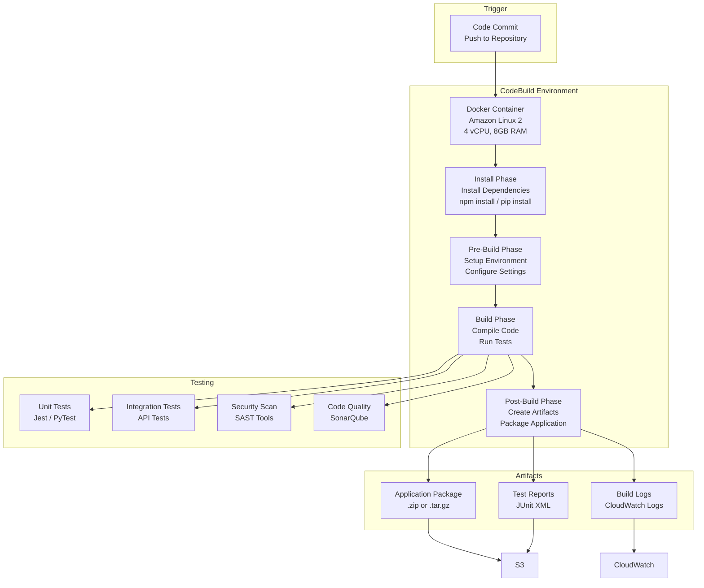

# Architecture Diagrams - CI/CD Pipeline Infrastructure

Comprehensive Mermaid diagrams for the automated CI/CD pipeline.

## 1. Complete CI/CD Pipeline Flow

```mermaid
graph LR
    subgraph Developer
        Dev[Developer<br/>Push Code]
        PR[Pull Request]
    end
    
    subgraph Source Control
        CodeCommit[AWS CodeCommit<br/>Git Repository<br/>3 Branches]
        Dev -->|git push| CodeCommit
        PR -->|merge| CodeCommit
    end
    
    subgraph CI/CD Pipeline
        Pipeline[AWS CodePipeline<br/>Orchestration]
        
        CodeCommit -->|Trigger| Pipeline
    end
    
    subgraph Build Stage
        CodeBuild[AWS CodeBuild<br/>Docker Container<br/>Run Tests]
        
        Pipeline -->|Source| CodeBuild
    end
    
    subgraph Artifact Storage
        S3[S3 Bucket<br/>Build Artifacts<br/>Versioned]
        
        CodeBuild -->|Store| S3
    end
    
    subgraph Deploy Stage
        CodeDeploy[AWS CodeDeploy<br/>Blue/Green Deploy]
        
        S3 -->|Retrieve| CodeDeploy
    end
    
    subgraph Environments
        Dev [Development<br/>Auto-Deploy]
        Staging[Staging<br/>Manual Approval]
        Prod[Production<br/>Manual Approval]
        
        CodeDeploy -->|Deploy| DevEnv
        CodeDeploy -->|Approval| Staging
        CodeDeploy -->|Approval| Prod
    end
    
    subgraph Notifications
        SNS[SNS Topic<br/>Email/Slack]
        
        Pipeline -->|Success/Failure| SNS
        Staging -->|Approval Request| SNS
        Prod -->|Approval Request| SNS
    end
```

## 2. Multi-Environment Deployment Strategy


## 3. CodePipeline Stages Detail


## 4. CodeBuild Build Process



## 5. Blue/Green Deployment Strategy


## 6. Pipeline Monitoring & Observability


## 7. Approval Process Flow


## 8. Security & Compliance in Pipeline


## 9. Rollback Mechanism


## 10. Cost Optimization in CI/CD


---

## Key Features

### 1. Automated Pipeline
- Source: AWS CodeCommit
- Build: AWS CodeBuild
- Deploy: AWS CodeDeploy
- Orchestration: AWS CodePipeline

### 2. Multi-Environment
- Development: Auto-deploy
- Staging: Manual approval
- Production: Manual approval

### 3. Blue/Green Deployment
- Zero-downtime deployments
- Instant rollback capability
- Health check validation

### 4. Security
- SAST/DAST scanning
- Dependency vulnerability checks
- Secrets detection
- Compliance gates

### 5. Monitoring
- CloudWatch metrics
- Real-time dashboards
- SNS notifications
- PagerDuty integration

---

**Author**: Rahul Ladumor  
**License**: MIT 2025
